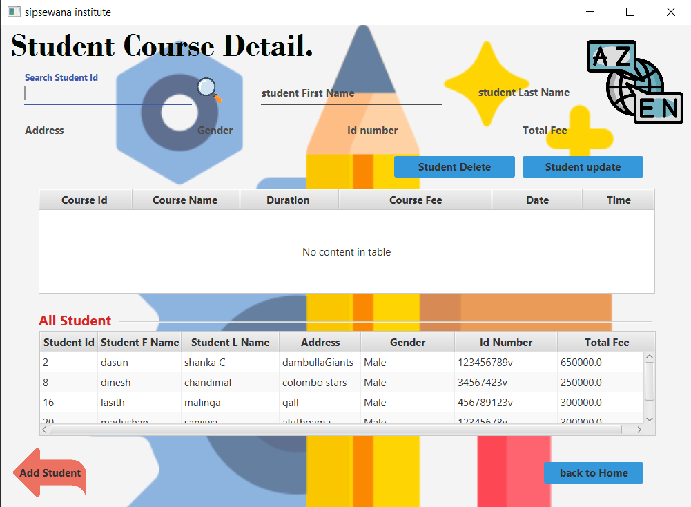
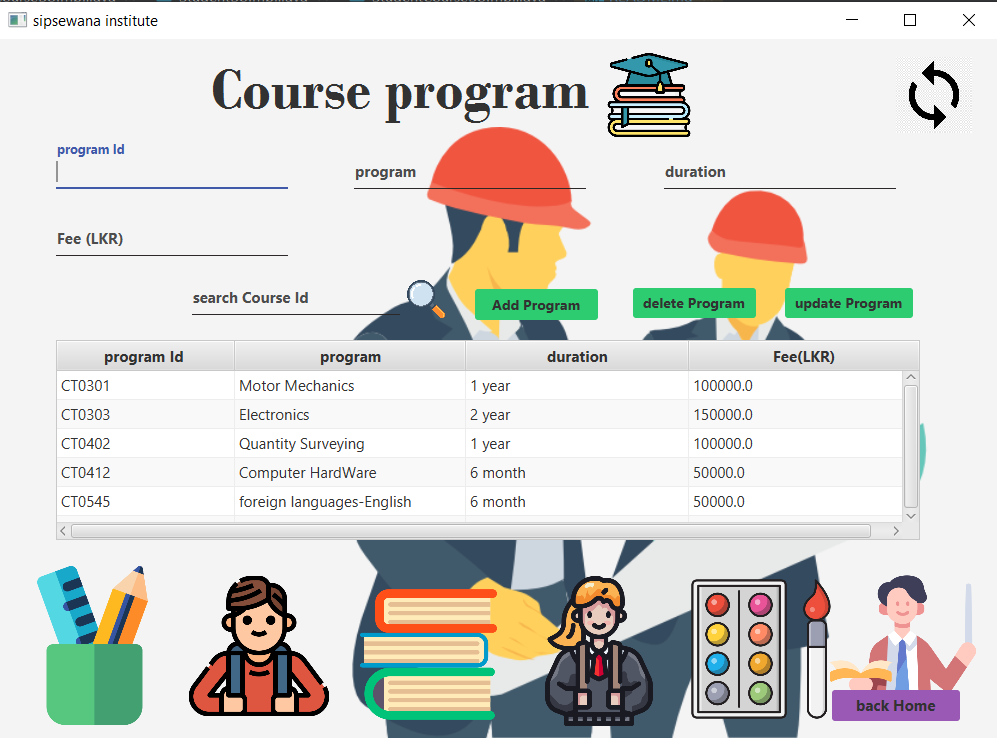
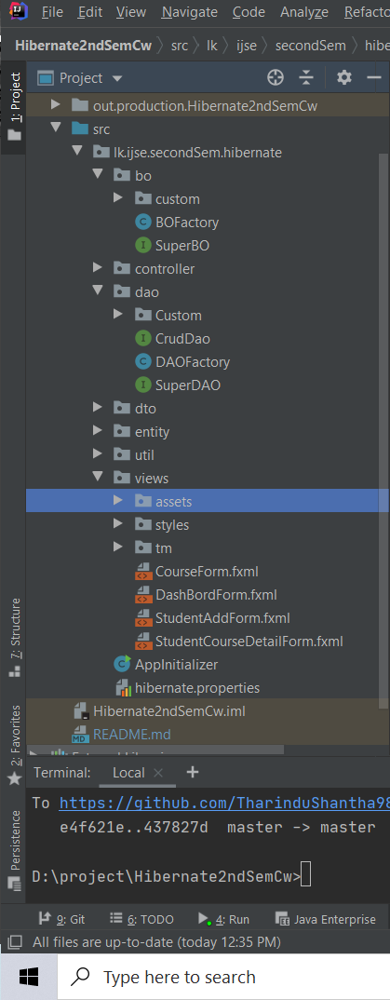

# Institute Of IJSE

second semester CW ORM concept, In this project, I used hibernate.

## Transformer

these project created for student registration of sipsewana institute.

## Prerequisites

This project requires Java set up.

## Project's function 

These project dashboard,
In this dashboard has three function.

 01. student add
            
            
 02. student registration details
            
            
 03. courses detail
             

 

##### student add function interface

This project , we can add new student and choose courses and count full total course fee.

 

##### student registration details

we can view  all student detail and student wise student detail

 

##### courses detail

we can view all course detail. we  can do  crud operation

 

## project architecture
I used Layered Architecture for this project.

 

